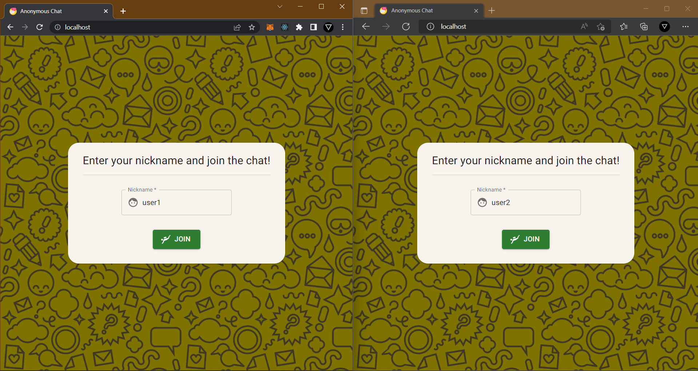
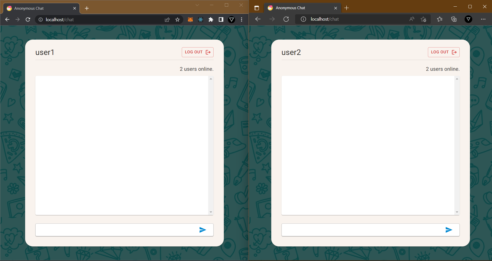
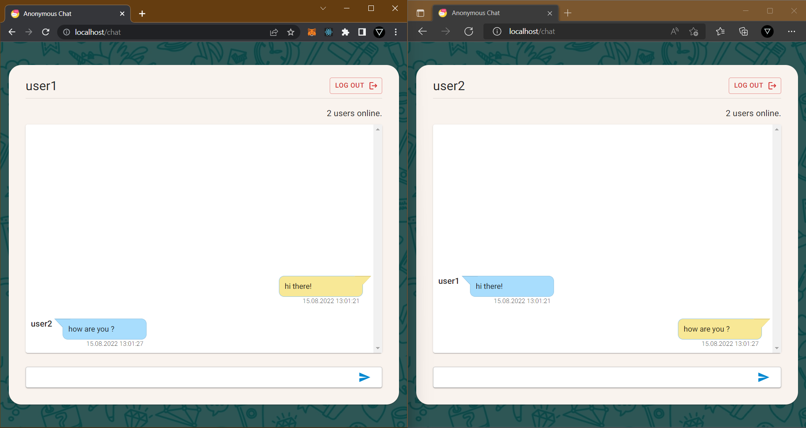
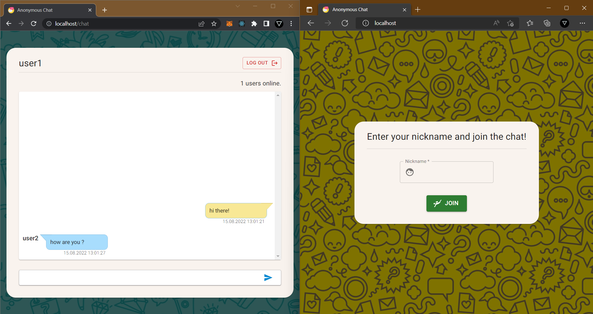

# Anonymous Chat

A simple realtime chat application which users join only enter their nicknames and see messages that are people writing. 

## Screenshots

## Commands

### Client Commands

- `yarn dev` starts application in development mode.
- `yarn start` starts application (builded application) in production mode.
- `yarn build` builds application to 'dist' folder.
- `yarn export` exports static html files to 'out' folder.

### Server Commands
- `yarn dev` starts application in development mode.
- `yarn start` starts application (builded application) in production mode.
- `yarn build` builds application to 'dist' folder.

### Start With Docker
 - Run `docker-compose up` command on terminal in directory which has `docker-compose.yml` file.

## Using Techs

